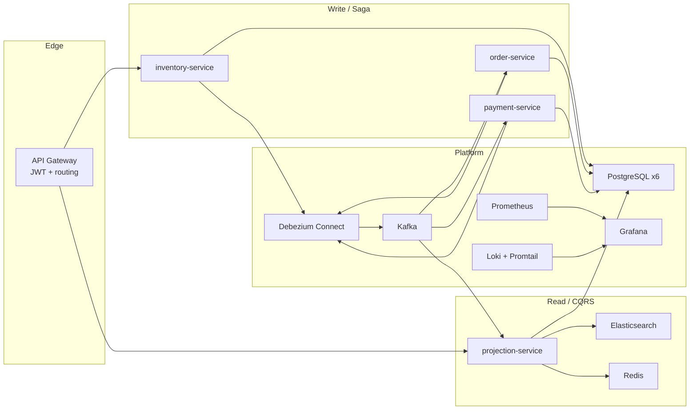
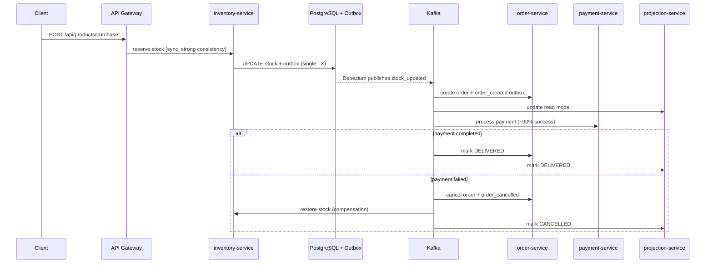

# E-Commerce Microservices Platform

> Portfolio-grade **event-driven microservices** reference implementation: **distributed saga**, **transactional outbox**, **CQRS read models**, **JWT-secured API gateway**, and a full **observability stack** — runnable locally with a single `docker compose up`.

[Java](https://openjdk.org/)
[Spring Boot](https://spring.io/projects/spring-boot)
[Kafka](https://kafka.apache.org/)
[PostgreSQL](https://www.postgresql.org/)
[Docker](https://docs.docker.com/compose/)
[License: MIT](LICENSE)

---


## Table of Contents

- [Why This Project](#why-this-project)
- [Architecture at a Glance](#architecture-at-a-glance)
- [Purchase Saga Flow](#purchase-saga-flow)
- [Tech Stack](#tech-stack)
- [Microservices](#microservices)
- [Reliability & Security Patterns](#reliability--security-patterns)
- [Observability](#observability)
- [Quick Start](#quick-start)
- [Demo Script](#demo-script)
- [API Entry Points](#api-entry-points)
- [Testing](#testing)
- [Project Structure](#project-structure)
- [Design Decisions](#design-decisions)
- [License](#license)

---


## Why This Project

This repository demonstrates how to design and operate a **cloud-native e-commerce backend** without hiding complexity behind a monolith. It is built to showcase skills that matter in modern backend and platform teams:


| Area                     | What you can evaluate                                                             |
| ------------------------ | --------------------------------------------------------------------------------- |
| **Distributed systems**  | Choreography-based **saga**, compensation, **at-least-once** delivery handling    |
| **Data consistency**     | **Transactional Outbox** + **Debezium CDC** instead of dual-write anti-patterns   |
| **Architecture styles**  | **CQRS**, **database-per-service**, **API Gateway**, **event-driven** integration |
| **Operational maturity** | **Prometheus**, **Grafana**, **Loki**, health probes, structured dashboards       |
| **Engineering quality**  | **Java 21**, **Spring Boot 4**, unit tests, Dockerized local environment          |


The stack is intentionally **over-instrumented for a portfolio project** so reviewers can trace a purchase end-to-end across services, Kafka topics, databases, and dashboards.

---


## Architecture at a Glance

```
Clients ──► API Gateway (JWT) ──► user-service | inventory-service | review-service | projection-service
                                      │                │
                                      │                └── synchronous stock reserve (write path)
                                      │
Kafka ◄── Debezium Outbox ◄── PostgreSQL (per service)
  │
  ├── order-service      (saga: create / cancel order)
  ├── payment-service    (saga: mock payment + compensation trigger)
  └── projection-service (CQRS read model + Elasticsearch search + Redis cache)
```




---


## Purchase Saga Flow

Purchase is a **choreography saga** (no central orchestrator). The happy path and compensation path are both observable in logs and Grafana.




**Notable implementation details:**

- **Optimistic stock reservation** via atomic SQL (`UPDATE … WHERE stock >= :qty`) — no lost updates under concurrency.
- **Checkout quote** hits inventory directly (not the read model) so price/stock are strongly consistent right before purchase.
- **Idempotent consumers** via `processed_events` (`INSERT … ON CONFLICT DO NOTHING`).
- **Saga compensation** on payment failure publishes `order_cancelled` to roll back inventory.

---


## Tech Stack


| Layer                  | Technologies                                                                |
| ---------------------- | --------------------------------------------------------------------------- |
| **Language & runtime** | **Java 21**, Maven                                                          |
| **Framework**          | **Spring Boot 4.0.4**, Spring Data JPA, Spring Security, Spring Kafka       |
| **API edge**           | **Spring Cloud Gateway** (WebMVC), **JWT** (JJWT)                           |
| **Messaging**          | **Apache Kafka** (KRaft), **Debezium** Outbox Event Router                  |
| **Databases**          | **PostgreSQL 17** (database-per-service, logical replication enabled)       |
| **Read model**         | **CQRS** projections, **Redis** cache, **Elasticsearch 9** full-text search |
| **Observability**      | **Micrometer**, **Prometheus**, **Grafana**, **Loki**, **Promtail**         |
| **Packaging**          | **Docker**, **Docker Compose**, multi-stage Dockerfiles, readiness probes   |
| **Testing**            | JUnit 5, Mockito, AssertJ, `@WebMvcTest`, service-layer unit tests          |


---


## Microservices


| Service                | Port | Role                                                    | Persistence             |
| ---------------------- | ---- | ------------------------------------------------------- | ----------------------- |
| **api-gateway**        | 8080 | Single entry point, JWT validation, route proxying      | —                       |
| **user-service**       | 8081 | Registration, login, JWT issuance, profile              | PostgreSQL              |
| **inventory-service**  | 8082 | Product catalog (write), checkout, purchase, stock saga | PostgreSQL + Outbox     |
| **order-service**      | 8083 | Order aggregate, saga reactions, compensation           | PostgreSQL + Outbox     |
| **payment-service**    | 8084 | Mock payment processor, saga participant                | PostgreSQL + Outbox     |
| **review-service**     | 8086 | Product reviews, review-created events                  | PostgreSQL + Outbox     |
| **projection-service** | 8087 | Catalog & order **read API**, search, cache             | PostgreSQL + Redis + ES |


**Supporting infrastructure (Docker Compose):** 6× PostgreSQL, Kafka, Kafka UI, Debezium Connect, Prometheus, Grafana, Loki, Promtail, Redis, Elasticsearch.

---


## Reliability & Security Patterns


### Event reliability

- **Transactional Outbox Pattern** — business data and outbox row committed in the same DB transaction.
- **Debezium CDC** — outbox rows streamed to Kafka without polling; topic routing via `EventRouter`.
- **Manual Kafka acknowledgment** — messages acked only after successful processing.
- **Retry + Dead Letter Topics (DLT)** — `DefaultErrorHandler` with `DeadLetterPublishingRecoverer` and dedicated DLT listeners.
- **Processed-event deduplication** — safe under **at-least-once** delivery semantics.
- **Scheduled cleanup** — old idempotency records purged to control table growth.


### Security

- **JWT authentication** at the API Gateway; downstream services trust gateway-injected identity headers.
- **Shared gateway secret** (`X-Gateway-Secret`) on internal/service-to-service calls — backend endpoints reject direct unauthenticated access.
- **Role-based access** (e.g. admin-only product creation).
- **Fail-closed** security configuration on protected routes.


### Data & consistency

- **Database-per-service** — no shared tables across bounded contexts.
- **CQRS** — writes in inventory/order/payment; reads served from projection-service.
- **Eventual consistency** on catalog/search; **strong consistency** on purchase via synchronous inventory reserve.

---


## Observability

Pre-provisioned **Grafana** dashboards (folder: **E-Commerce**):


| Dashboard            | Focus                                                                                                                                                     |
| -------------------- | --------------------------------------------------------------------------------------------------------------------------------------------------------- |
| **E-Commerce Stack** | Service uptime, HTTP traffic, **5xx error rate**, JVM heap, Kafka listener activity, **HikariCP pool**, business counters (purchases, saga compensations) |
| **JVM (Micrometer)** | Per-service JVM & HTTP drill-down                                                                                                                         |
| **Service Logs**     | **Loki** log tail with service filter                                                                                                                     |


| URL                                                         | Default credentials |
| ----------------------------------------------------------- | ------------------- |
| Grafana — [http://localhost:3000](http://localhost:3000)    | `admin` / `admin`   |
| Prometheus — [http://localhost:9090](http://localhost:9090) | —                   |
| Kafka UI — [http://localhost:8090](http://localhost:8090)   | —                   |


All Spring services expose `/actuator/prometheus` and **readiness/liveness** probes used by Compose health checks.

---


## Quick Start


### Prerequisites

- **Docker Desktop** (or Docker Engine + Compose v2)
- **8 GB+ RAM** recommended (Elasticsearch + full stack)
- Optional: **Python 3.10+** for the demo script


### 1. Clone and configure

```bash
git clone https://github.com/tahaberkamcadev/ecom.git
cd ecom
cp .env.example .env
```


### 2. Start the full stack

```bash
docker compose up -d
```

First boot takes **3–5 minutes** (Elasticsearch, Debezium connector registration, service health checks). Watch progress:

```bash
docker compose ps
```


### 3. Verify the gateway

```bash
curl -s http://localhost:8080/actuator/health | jq .
```


### 4. Log in (seeded demo users)


| User     | Email                 | Password         | Role     |
| -------- | --------------------- | ---------------- | -------- |
| Admin    | `admin@demo.local`    | `DemoAdmin1!`    | ADMIN    |
| Customer | `customer@demo.local` | `DemoCustomer1!` | CUSTOMER |


```bash
curl -s -X POST http://localhost:8080/api/v1/auth/login \
  -H "Content-Type: application/json" \
  -d '{"email":"admin@demo.local","password":"DemoAdmin1!"}'
```

Use the returned `access_token` as `Authorization: Bearer <token>` on subsequent requests.

### 5. Browse the catalog

```bash
curl -s "http://localhost:8080/api/catalog/products?category=ELECTRONICS" \
  -H "Authorization: Bearer <token>"
```

---


## Demo Script

A Python client exercises checkout + purchase flows against the gateway (bulk order + several small orders):

```bash
pip install -r scripts/requirements.txt
python scripts/demo_script.py
```

Options:

```bash
python scripts/demo_script.py --dry-run          # login + catalog only
python scripts/demo_script.py --skip-bulk        # small orders only
```

While the script runs, open **Grafana → E-Commerce Stack** to watch HTTP rates, Kafka activity, saga compensations (~10% payment failure rate), and DB pool metrics update in real time.

---


## API Entry Points

All external traffic goes through the **API Gateway** (`localhost:8080`):


| Path prefix        | Service            | Examples                                                        |
| ------------------ | ------------------ | --------------------------------------------------------------- |
| `/api/v1/auth/**`  | user-service       | `POST /api/v1/auth/login`, `POST /api/v1/auth/register`         |
| `/api/v1/users/**` | user-service       | Profile, password change                                        |
| `/api/products/**` | inventory-service  | `POST /api/products/purchase`, `POST /api/products/checkout`    |
| `/api/reviews/**`  | review-service     | `POST /api/reviews`                                             |
| `/api/catalog/**`  | projection-service | `GET /api/catalog/products`, `GET /api/catalog/products/search` |


**Saga participants** (`order-service`, `payment-service`) are intentionally **not** exposed via the gateway — they communicate through **Kafka events** only.

---


## Testing

```bash
# Run tests per service (example)
cd inventory-service && ./mvnw test
cd projection-service && ./mvnw test
cd order-service && ./mvnw test
```

The codebase includes **28 unit tests (121 test methods)** covering saga consumers, outbox services, idempotency, catalog controllers, cache DTOs, JWT/auth flows, and core domain logic — with **Mockito**-based isolation (no full stack required for unit tests).

---


## Project Structure

```
ecom/
├── api-gateway/           # Spring Cloud Gateway, JWT filter
├── user-service/          # Auth & identity
├── inventory-service/     # Catalog write, purchase, stock saga
├── order-service/         # Order aggregate & saga reactions
├── payment-service/       # Payment saga participant
├── review-service/        # Reviews & review-created events
├── projection-service/    # CQRS read model, Redis, Elasticsearch
├── infra/
│   ├── prometheus/        # Scrape config (all Spring Boot services)
│   ├── grafana/           # Dashboards + datasource provisioning
│   ├── loki/              # Log aggregation
│   ├── promtail/          # Docker log shipping
│   └── debezium/          # Outbox connector definitions
├── scripts/               # End-to-end demo client
├── compose.yaml           # Full local stack
├── .env.example           # Environment template
└── README.md
```

---


## Design Decisions

1. **Outbox over dual writes** — guarantees that domain changes and outbound events never diverge.
2. **Choreography over orchestration** — keeps services autonomous; compensation is event-driven.
3. **Sync reserve + async saga** — inventory reserve is synchronous (client needs an immediate answer); downstream steps are asynchronous.
4. **Checkout on write model** — CQRS read paths may lag; checkout reads authoritative inventory prices/stock before purchase.
5. **Mock payment with failure injection** — ~10% failure rate demonstrates **saga compensation** without external payment APIs.
6. **Observability as a first-class concern** — metrics, logs, and business counters.

---


## License

This project is licensed under the **MIT License** — see [LICENSE](LICENSE).

---

**Author:** [Taha Berk Amca](https://github.com/tahaberkamcadev)

*Built as a portfolio-grade reference for event-driven microservices, distributed transactions, and cloud-native observability.*