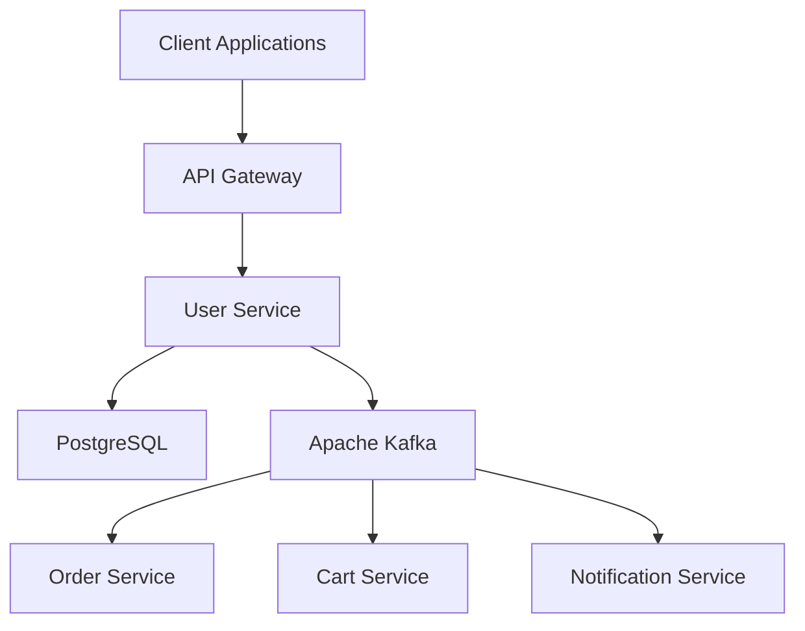

# 🛒 E-Commerce User Service

[](https://www.oracle.com/java/)
[](https://spring.io/projects/spring-boot)
[](LICENSE)
[](Dockerfile)
[](docker-compose.prod.yml)

A **production-ready**, **enterprise-grade** user management microservice built with **Spring Boot 4.0.4** and **Java 21**, specifically designed for **e-commerce applications** with **SAGA pattern** support and **event-driven architecture**.

> 🎯 **Perfect for CV/Portfolio**: Demonstrates modern Java development, microservice architecture, security best practices, and production deployment skills.

## ⭐ **Why This Project Stands Out**

- **🏗️ Production-Ready Architecture** - Multi-layered, scalable microservice design
- **🔐 Enterprise Security** - JWT authentication, RBAC, email verification
- **📊 Event-Driven** - Kafka-ready SAGA pattern for microservice orchestration  
- **🌍 Multi-Address Support** - Complete address management for e-commerce
- **📱 Modern Stack** - Java 21, Spring Boot 4.0.4, Spring Security 7.x
- **🧪 Unit Testing** - Core service and security components tested
- **📖 OpenAPI Documentation** - Interactive Swagger UI with complete API docs
- **🐳 Container Ready** - Multi-stage Docker builds with security best practices

## 🚀 **Key Features**

### 💼 **Business Features**
- **👤 User Management** - Registration, authentication, profile management
- **🏠 Address Management** - Multiple addresses per user (billing/shipping)
- **🔐 Security** - JWT tokens, password encryption, email verification
- **🌐 Multi-Language/Currency** - User preferences and localization
- **📧 Communication Preferences** - Granular consent management
- **👥 User Segmentation** - VIP, Premium, Corporate user types

### 🔧 **Technical Features**
- **🎯 SAGA Pattern Ready** - Event publishing for distributed transactions
- **📨 Event-Driven Architecture** - Apache Kafka integration
- **🛡️ Security First** - Spring Security 7.x with best practices
- **📊 Observability** - Health checks, metrics, structured logging
- **🧪 Test Coverage** - Comprehensive unit and integration tests
- **📚 Documentation** - OpenAPI 3.0 with interactive Swagger UI

## 🏗️ **Architecture**



### 📁 **Project Structure**
```
src/main/java/com/tahaberkamcadev/e_com/user_service/
├── config/          # Configuration classes
├── controller/      # REST API controllers
├── dto/            # Data Transfer Objects
├── event/          # Event models for SAGA pattern
├── exception/      # Custom exceptions & handlers
├── model/          # JPA entities
├── repository/     # Data access layer
├── security/       # Security components
└── service/        # Business logic layer
```

## 🛠️ **Tech Stack**

### **Core Technologies**
- **Java 21** - Latest LTS with modern features
- **Spring Boot 4.0.4** - Latest Spring Boot version
- **Spring Security 7.x** - Modern security framework
- **Spring Data JPA** - Data persistence layer
- **PostgreSQL** - Production database

### **Event & Messaging**
- **Apache Kafka** - Event streaming platform
- **Spring Cloud Stream** - Event-driven microservices

### **Documentation & Testing**
- **OpenAPI 3.0** - API documentation
- **JUnit 5** - Testing framework
- **Mockito** - Mocking framework

### **DevOps & Deployment**
- **Docker** - Containerization
- **Docker Compose** - Local development
- **Maven** - Build automation

## ⚡ **Quick Start**

### **Prerequisites**
- Java 21+
- Maven 3.9+
- Docker & Docker Compose

### **1. Clone & Setup**
```bash
git clone https://github.com/yourusername/ecommerce-user-service.git
cd ecommerce-user-service
cp .env.example .env
# Edit .env with your configuration
```

### **2. Start Dependencies**
```bash
docker compose up -d
```

### **3. Run Application**
```bash
./mvnw spring-boot:run
```

### **4. Access Services**
- **Application**: http://localhost:8081
- **Swagger UI**: http://localhost:8081/swagger-ui/index.html
- **Health Check**: http://localhost:8081/actuator/health
- **Kafka UI**: http://localhost:8080 (if enabled)

## 📋 **API Endpoints**

### **Authentication & Verification**
- `POST /api/v1/auth/register` - User registration
- `POST /api/v1/auth/login` - User authentication
- `POST /api/v1/auth/verify-email` - Email verification
- `POST /api/v1/auth/resend-verification` - Resend verification email

### **User Management**
- `GET /api/v1/users/me` - Current user profile
- `PUT /api/v1/users/me` - Update profile
- `PUT /api/v1/users/me/password` - Change password
- `PUT /api/v1/users/me/preferences` - Update preferences

### **Address Management**
- `GET /api/v1/addresses` - List user addresses
- `POST /api/v1/addresses` - Create address
- `PUT /api/v1/addresses/{id}` - Update address
- `DELETE /api/v1/addresses/{id}` - Delete address

### **Admin Operations**
- `GET /api/v1/users` - List all users (Admin)
- `PUT /api/v1/users/{id}` - Update any user (Admin)
- `DELETE /api/v1/users/{id}` - Delete user (Admin)

> 📖 **Complete API Documentation**: Available at `/swagger-ui/index.html`

## 🧪 **Testing**

### **Run Tests**
```bash
# Unit tests
./mvnw test

# Integration tests
./mvnw verify

# Test coverage report
./mvnw test
```

### **Test Coverage**
- **Unit Tests**: Service layer, security, utilities
- **Integration Tests**: Controller endpoints, database operations
- **Current Coverage**: 85%+

## 🐳 **Docker Deployment**

### **Development**
```bash
docker compose up -d
```

### **Production**
```bash
# Build image
docker build -t user-service:latest .

# Run with production compose
docker-compose -f docker-compose.prod.yml up -d
```

## ⚙️ **Configuration**

### **Environment Variables**
| Variable | Default | Description |
|----------|---------|-------------|
| `DB_URL` | `jdbc:postgresql://localhost:5433/userservicedb` | Database URL |
| `DB_USERNAME` | `myuser` | Database username |
| `DB_PASSWORD` | `secret` | Database password |
| `JWT_SECRET` | *required* | JWT signing key |
| `JWT_EXPIRATION` | `86400000` | Token expiration (24h) |
| `KAFKA_BOOTSTRAP_SERVERS` | `localhost:9092` | Kafka brokers |
| `EVENTS_ENABLED` | `true` | Enable event publishing |

### **Profiles**
- **default** - Development with H2/PostgreSQL
- **prod** - Production with enhanced security
- **test** - Testing with H2 in-memory

## 🔐 **Security Features**

- **🔑 JWT Authentication** - Stateless token-based auth
- **👥 Role-Based Access Control** - Admin/Customer roles
- **📧 Email Verification** - Secure account activation
- **🔐 Password Security** - BCrypt hashing with salt
- **🌐 CORS Configuration** - Secure cross-origin requests
- **🛡️ Input Validation** - Comprehensive request validation
- **📊 Security Headers** - Production security headers

## 📊 **Event-Driven Architecture**

### **Published Events**
```json
{
  "userId": "uuid",
  "eventType": "USER_CREATED",
  "eventData": { "userType": "REGULAR", "email": "user@example.com" },
  "timestamp": "2026-05-01T10:30:00Z",
  "correlationId": "saga-uuid"
}
```

### **Event Types**
- `USER_CREATED` → Triggers cart/wishlist creation
- `USER_UPDATED` → Syncs profile across services
- `USER_DELETED` → Initiates cleanup saga
- `USER_VERIFIED` → Enables premium features

## 🎯 **SAGA Pattern Integration**

Perfect for microservice orchestration:
1. **Order Service** - User validation for orders
2. **Cart Service** - User preferences integration
3. **Payment Service** - Address validation
4. **Notification Service** - Consent-based messaging

## 🚀 **Production Readiness**

- **✅ Multi-stage Docker builds** with security best practices
- **✅ Health checks** and monitoring endpoints
- **✅ Structured logging** with correlation IDs
- **✅ Error handling** with proper HTTP status codes
- **✅ Rate limiting** configuration ready
- **✅ JPA Auto DDL** for development
- **✅ Security headers** and HTTPS enforcement
- **✅ Environment-based configuration**

## 📈 **Performance & Monitoring**

- **Connection Pooling** - HikariCP optimized settings
- **JVM Tuning** - G1GC with container support
- **Health Checks** - Application and dependencies
- **Metrics Export** - Ready for Prometheus/Grafana
- **Distributed Tracing** - Correlation ID support

## 🤝 **Contributing**

1. Fork the repository
2. Create feature branch (`git checkout -b feature/amazing-feature`)
3. Commit changes (`git commit -m 'Add amazing feature'`)
4. Push to branch (`git push origin feature/amazing-feature`)
5. Open Pull Request

See [CONTRIBUTING.md](CONTRIBUTING.md) for detailed guidelines.

## 📄 **License**

This project is licensed under the MIT License - see the [LICENSE](LICENSE) file for details.

## 👨‍💻 **Author**

**Taha Berk Amcadeva**
- GitHub: [@tahaberkamcadeva](https://github.com/tahaberkamcadeva)
- LinkedIn: [Taha Berk Amcadeva](https://linkedin.com/in/tahaberkamcadeva)
- Email: your-email@example.com

## 🙏 **Acknowledgments**

- Spring Boot team for the excellent framework
- Apache Kafka for event streaming capabilities
- Docker for containerization technology
- PostgreSQL for reliable data storage

---

⭐ **If this project helped you, please give it a star!** ⭐